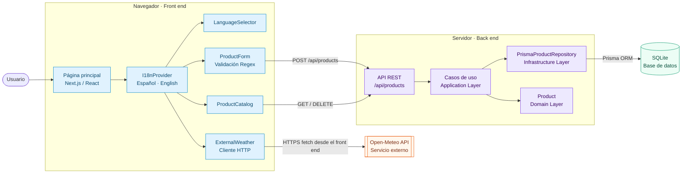

# Diagrama de componentes — Tienda N-Capas

El diagrama muestra la separación por capas, la internacionalización, la validación con expresiones regulares y el consumo directo del servicio externo Open-Meteo desde el front end.

## Responsabilidades

| Componente | Responsabilidad |
|---|---|
| `I18nProvider` | Mantener el idioma y entregar los textos traducidos a la interfaz. |
| `ProductForm` | Validar los datos con regex y enviar productos a la API interna. |
| `ProductCatalog` | Consultar, filtrar, mostrar y eliminar productos. |
| `ExternalWeather` | Consumir Open-Meteo directamente con `fetch` desde el navegador. |
| API REST | Exponer las operaciones de productos a la capa de presentación. |
| Casos de uso y dominio | Aplicar las reglas de negocio sin depender de la interfaz. |
| Repositorio Prisma | Traducir las operaciones del dominio a persistencia SQLite. |

La flecha `ExternalWeather → Open-Meteo API` demuestra que el servicio externo se consume desde el front end y no mediante la API interna de la aplicación.
